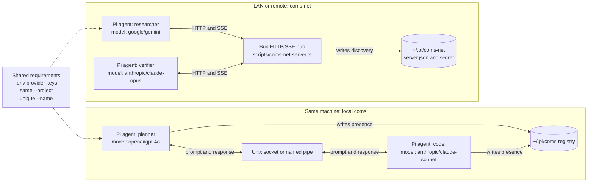
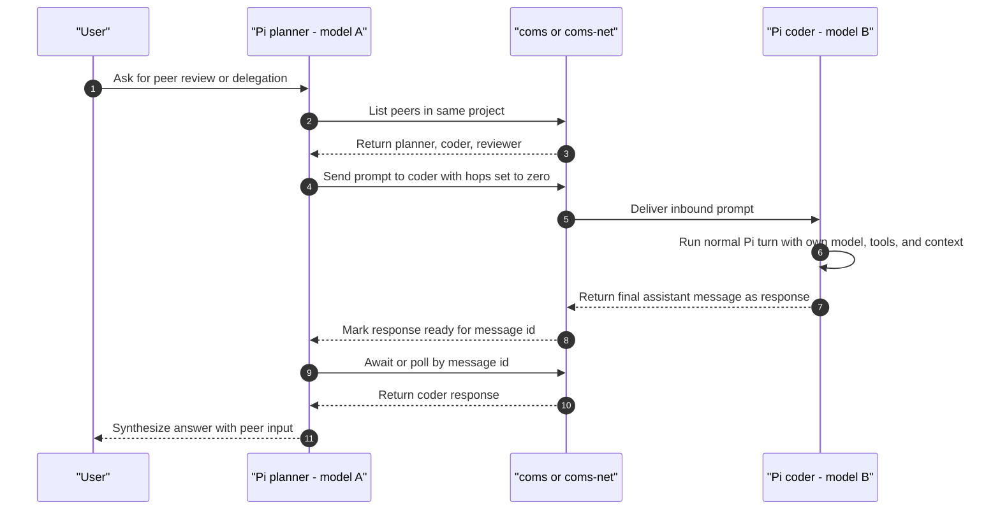

# Pi-to-Pi setup with different models

This project contains two Pi-to-Pi communication extensions:

- `extensions/coms.ts` — same-machine peer-to-peer messaging over Unix sockets / Windows named pipes. No server.
- `extensions/coms-net.ts` + `scripts/coms-net-server.ts` — networked Pi-to-Pi messaging over HTTP/SSE through a shared hub.

Use `coms` when all agents run on one machine. Use `coms-net` when agents run across terminals, machines, VMs, or a LAN.

## Architecture diagrams

### Transport architecture



### Message flow



## Critical project review

### What is good

- The architecture is small and composable: normal Pi sessions plus an extension, not a separate orchestrator product.
- Both transports expose a simple four-tool protocol: list peers, send, poll, await.
- Agents can use heterogeneous models in the same pool via Pi's normal `--model` / `--provider` flags.
- Safety basics are present: hop limit, audit log metadata, stale-peer cleanup, and localhost-by-default for the network hub.
- The `justfile` gives useful recipes for common agent/model combinations.

### What needs attention

- `README.md` has quick starts, but not a full end-to-end setup guide; this file fills that gap.
- The current runtime environment must provide `bun` and `just`. If either is missing, the recipes fail; direct `pi ...` commands below avoid `just` where useful.
- `scripts/coms-net-server.ts` comments reference `specs/coms-net-v1.md`, but that spec file is not present in the repository.
- Some model names in `justfile` are environment/version dependent. Always verify with `pi --list-models <search>` before copying a recipe.
- `pi-pi` means the meta-agent in `extensions/pi-pi.ts`, while “Pi-to-Pi” means `coms` / `coms-net`. The names are easy to confuse.
- There is no automated smoke test for starting two agents and exchanging a message.

## Prerequisites

Minimum for local `coms` agents and `coms-net` clients:

```bash
npm install -g @earendil-works/pi-coding-agent
pi --version
```

Additional tools for the repository recipes and bundled network hub:

```bash
# macOS examples
brew install oven-sh/bun/bun just

# verify
bun --version
just --version
```

Install project dependencies if you use Bun-based workflows or want a fully prepared checkout:

```bash
cd /path/to/pi-vs-claude-code
bun install
```

Create `.env` and add provider keys for every model family you want to run:

```bash
cp .env.sample .env
$EDITOR .env
```

Typical keys:

```bash
OPENAI_API_KEY=...
ANTHROPIC_API_KEY=...
GEMINI_API_KEY=...
OPENROUTER_API_KEY=...
```

`just` recipes auto-load `.env` because the `justfile` has `set dotenv-load := true`. If you run `pi` directly, source it yourself:

```bash
set -a
source .env
set +a
```

Verify that Pi sees the models you plan to use:

```bash
pi --list-models gpt
pi --list-models claude
pi --list-models gemini
pi --list-models openrouter
```

Model syntax accepted by Pi:

```bash
pi --model openai/gpt-4o
pi --provider anthropic --model claude-sonnet-4-5
pi --model sonnet:high          # with thinking shorthand
pi --thinking high --model ...  # thinking as separate flag
```

## Start script without `just`

If you do not have `just`, use the wrapper script:

```bash
scripts/start-pi2pi.sh --help
```

Local Pi-to-Pi agent, no `just` and no `bun` required:

```bash
scripts/start-pi2pi.sh \
  --transport local \
  --model openai/gpt-4o \
  --name planner \
  --project demo \
  --purpose "Plans the work" \
  --color "#36F9F6"
```

Second local agent with another model:

```bash
scripts/start-pi2pi.sh \
  --transport local \
  --model anthropic/claude-sonnet-4-5 \
  --name coder \
  --project demo \
  --purpose "Writes and checks code" \
  --color "#FF7EDB"
```

Network client, still no `just` required. This also does not require `bun` if a `coms-net` hub is already running somewhere:

```bash
scripts/start-pi2pi.sh \
  --transport net \
  --model google/gemini-2.5-pro \
  --name reviewer \
  --project demo \
  --server-url http://127.0.0.1:52965 \
  --auth-token "$PI_COMS_NET_AUTH_TOKEN"
```

Important limitation: starting the bundled `coms-net` hub still requires `bun`, because `scripts/coms-net-server.ts` uses `Bun.serve`. Local `coms` agents and `coms-net` clients only need the `pi` CLI.

## Roles: what exists out of the box?

There are no built-in Pi-to-Pi roles like `coder`, `planner`, or `reviewer`. Those names in examples are just agent names.

Pi-to-Pi separates three ideas:

- `--name` — addressable peer name. Example: `planner`, `coder`, `gemini-a`.
- `--purpose` — short metadata shown in peer lists/widgets. It helps humans and other agents choose a peer, but by itself it does not change the model's behavior.
- actual role/persona — instructions in the Pi system prompt, context files, or the user's prompt. Use `--role-prompt` in the wrapper script, or Pi's normal `--system-prompt` / `--append-system-prompt` flags.

Example with a real planning persona:

```bash
pi2pi \
  --transport local \
  --model openai/gpt-4o \
  --name planner \
  --project demo \
  --purpose "Planning specialist" \
  --role-prompt "You are a planning specialist. Produce options, risks, dependencies, and a concise recommended plan. Do not edit files unless explicitly asked."
```

Same role across multiple models is valid. Give them different names but the same purpose/role prompt:

```bash
pi2pi --transport local --model openai/gpt-4o \
  --name brainstorm-gpt --project brainstorm \
  --purpose "Brainstorm participant" \
  --role-prompt "You are one participant in a multi-model brainstorm. Generate distinct ideas, critique assumptions, and avoid repeating peers."

pi2pi --transport local --model anthropic/claude-sonnet-4-5 \
  --name brainstorm-claude --project brainstorm \
  --purpose "Brainstorm participant" \
  --role-prompt "You are one participant in a multi-model brainstorm. Generate distinct ideas, critique assumptions, and avoid repeating peers."

pi2pi --transport local --model google/gemini-2.5-pro \
  --name brainstorm-gemini --project brainstorm \
  --purpose "Brainstorm participant" \
  --role-prompt "You are one participant in a multi-model brainstorm. Generate distinct ideas, critique assumptions, and avoid repeating peers."
```

Then ask one of them to coordinate the discussion:

```text
Use coms_list to find the other brainstorm participants. Ask each for 5 ideas about <topic>. Wait for both replies, cluster the ideas, identify disagreements, and propose the top 3 directions.
```

For planning with three models using the same role:

```text
Use coms_list. Ask the two other planning participants to independently create a plan for <task>. Wait for replies. Compare all three plans, merge the strongest parts, and call out unresolved risks.
```

This is not an autonomous free-for-all chat room. A model starts a discussion by calling `coms_send` / `coms_net_send`; replies are returned to that sender. To avoid ping-pong loops, inbound agents should simply answer the prompt. They should not send a new message back unless explicitly asked to start a separate round.

## Make Pi-to-Pi globally available

Recommended: expose the start script on your `PATH`. The script resolves the repository path even when invoked through a symlink, so it can be run from any project directory.

```bash
mkdir -p ~/.local/bin
ln -sf /path/to/pi-vs-claude-code/scripts/start-pi2pi.sh ~/.local/bin/pi2pi

# add this to ~/.zshrc or ~/.bashrc if needed
export PATH="$HOME/.local/bin:$PATH"
```

Now start an agent from any project:

```bash
cd /path/to/any/project
pi2pi \
  --transport local \
  --model openai/gpt-4o \
  --name planner \
  --project "$(basename "$PWD")" \
  --purpose "Plans work in this repo"
```

Second agent, same arbitrary project, different model:

```bash
cd /path/to/any/project
pi2pi \
  --transport local \
  --model anthropic/claude-sonnet-4-5 \
  --name coder \
  --project "$(basename "$PWD")" \
  --purpose "Implements work in this repo"
```

Alternative: call Pi directly with absolute extension paths from any directory:

```bash
pi \
  -e /path/to/pi-vs-claude-code/extensions/coms.ts \
  -e /path/to/pi-vs-claude-code/extensions/minimal.ts \
  -e /path/to/pi-vs-claude-code/extensions/theme-cycler.ts \
  --model openai/gpt-4o \
  --name planner \
  --project demo
```

You can also add absolute extension paths to `~/.pi/agent/settings.json`, but that auto-loads the extension into every Pi session. For Pi-to-Pi, the wrapper script is usually safer because you opt in per session.

If you do copy extensions into `~/.pi/agent/extensions/`, copy the support file too:

```bash
mkdir -p ~/.pi/agent/extensions/pi2pi
cp /path/to/pi-vs-claude-code/extensions/coms.ts ~/.pi/agent/extensions/pi2pi/index.ts
cp /path/to/pi-vs-claude-code/extensions/themeMap.ts ~/.pi/agent/extensions/pi2pi/themeMap.ts
```

For `coms-net`, copy `coms-net.ts` as `index.ts` instead. Do not copy both as `index.ts` into the same directory.

## Option A: same-machine Pi-to-Pi with `coms`

Use this when both agents run on the same host.

### Start two agents with different models

Terminal 1:

```bash
cd /path/to/pi-vs-claude-code
set -a; source .env; set +a
pi \
  --model openai/gpt-4o \
  -e extensions/coms.ts \
  -e extensions/minimal.ts \
  -e extensions/theme-cycler.ts \
  --name planner \
  --project demo \
  --purpose "Plans and reviews architecture" \
  --color "#36F9F6"
```

Terminal 2:

```bash
cd /path/to/pi-vs-claude-code
set -a; source .env; set +a
pi \
  --model anthropic/claude-sonnet-4-5 \
  -e extensions/coms.ts \
  -e extensions/minimal.ts \
  -e extensions/theme-cycler.ts \
  --name coder \
  --project demo \
  --purpose "Implements and checks code" \
  --color "#FF7EDB"
```

Equivalent `just` form:

```bash
just local-coms --model openai/gpt-4o --name planner --project demo --purpose "Plans"
just local-coms --model anthropic/claude-sonnet-4-5 --name coder --project demo --purpose "Codes"
```

### Use it

Ask either agent:

```text
List your peers, ask coder to propose an implementation plan, then wait for the reply.
```

The model should call:

1. `coms_list`
2. `coms_send` with `target: "coder"`
3. `coms_await` with the returned `msg_id`

You can also be explicit:

```text
Use coms_send to ask planner: "Review this API design: ..." Then use coms_await for the response.
```

### Where local state lives

- Registry: `~/.pi/coms/projects/<project>/agents/*.json`
- Sockets: `~/.pi/coms/sockets/`
- Audit channel: `coms-log` in the Pi session

To reset stale local state:

```bash
rm -rf ~/.pi/coms/projects/demo
```

## Option B: networked Pi-to-Pi with `coms-net`

Use this when agents may run on different machines.

### Localhost hub on one machine

Terminal 1 — start hub:

```bash
cd /path/to/pi-vs-claude-code
bun scripts/coms-net-server.ts
```

The server writes discovery files under:

```text
~/.pi/coms-net/projects/default/server.json
~/.pi/coms-net/projects/default/server.secret.json
```

For localhost-only mode the token is generated automatically and stored in `server.secret.json` with mode `0600`.

Terminal 2 — agent A:

```bash
cd /path/to/pi-vs-claude-code
set -a; source .env; set +a
pi \
  --model openai/gpt-4o \
  -e extensions/coms-net.ts \
  -e extensions/minimal.ts \
  -e extensions/theme-cycler.ts \
  --name researcher \
  --project default \
  --purpose "Finds facts and alternatives" \
  --color "#36F9F6"
```

Terminal 3 — agent B:

```bash
cd /path/to/pi-vs-claude-code
set -a; source .env; set +a
pi \
  --model anthropic/claude-opus-4-7 \
  -e extensions/coms-net.ts \
  -e extensions/minimal.ts \
  -e extensions/theme-cycler.ts \
  --name verifier \
  --project default \
  --purpose "Critiques and verifies answers" \
  --color "#FF7EDB"
```

Equivalent `just` form:

```bash
just coms-net-server
just coms  --model openai/gpt-4o --name researcher --purpose "Research"
just coms2 --name verifier --purpose "Verify"
```

### LAN or remote hub

On the hub machine:

```bash
cd /path/to/pi-vs-claude-code
export PI_COMS_NET_AUTH_TOKEN="$(openssl rand -hex 32)"
export PI_COMS_NET_HOST=0.0.0.0
export PI_COMS_NET_PORT=52965
bun scripts/coms-net-server.ts
```

On every client machine:

```bash
cd /path/to/pi-vs-claude-code
set -a; source .env; set +a
export PI_COMS_NET_SERVER_URL="http://<hub-ip>:52965"
export PI_COMS_NET_AUTH_TOKEN="<same-token>"

pi \
  --model google/gemini-2.5-pro \
  -e extensions/coms-net.ts \
  --name remote-scout \
  --project demo \
  --purpose "Remote research agent"
```

You can pass connection info as flags instead of env vars:

```bash
pi \
  --model openai/gpt-4o \
  -e extensions/coms-net.ts \
  --server-url http://<hub-ip>:52965 \
  --auth-token "$PI_COMS_NET_AUTH_TOKEN" \
  --name dev \
  --project demo
```

For anything beyond a trusted LAN, put TLS in front of the hub and use `https://...` as `PI_COMS_NET_SERVER_URL`.

### Use it

Ask either agent:

```text
Use coms_net_list to find peers. Send verifier a short design proposal and wait for its critique.
```

The model should call:

1. `coms_net_list`
2. `coms_net_send`
3. `coms_net_await` or `coms_net_get`

Useful slash command inside an agent:

```text
/coms-net --server
/coms-net --reconnect
/coms-net --all
```

## Running more than two models

Start one terminal per agent. Keep the same `--project`, vary `--name`, `--purpose`, and `--model`:

```bash
pi --model openai/gpt-4o                -e extensions/coms.ts --project demo --name planner
pi --model anthropic/claude-sonnet-4-5  -e extensions/coms.ts --project demo --name coder
pi --model google/gemini-2.5-pro        -e extensions/coms.ts --project demo --name reviewer
```

For `coms-net`, use the same pattern with `-e extensions/coms-net.ts` and a running hub.

## Custom/local models

For Ollama, vLLM, LM Studio, or other OpenAI-compatible servers, add models to `~/.pi/agent/models.json`:

```json
{
  "providers": {
    "ollama": {
      "baseUrl": "http://localhost:11434/v1",
      "api": "openai-completions",
      "apiKey": "ollama",
      "compat": {
        "supportsDeveloperRole": false,
        "supportsReasoningEffort": false
      },
      "models": [
        {
          "id": "qwen2.5-coder:7b",
          "name": "Qwen Coder 7B Local",
          "contextWindow": 128000,
          "maxTokens": 8192
        }
      ]
    }
  }
}
```

Then run one peer on the local model:

```bash
pi --model ollama/qwen2.5-coder:7b -e extensions/coms.ts --name local-coder --project demo
```

If the colon in a model ID conflicts with Pi's thinking shorthand, prefer:

```bash
pi --provider ollama --model 'qwen2.5-coder:7b' -e extensions/coms.ts --name local-coder --project demo
```

## Troubleshooting

### `just: command not found`

Install `just`, or use the direct `pi ...` commands above.

### `bun: command not found`

Install Bun. `coms-net` server requires Bun because it uses `Bun.serve`.

### Model not found

Run:

```bash
pi --list-models '<search-term>'
```

Then copy the provider/model exactly, or use `--provider <provider> --model <id>`.

### No API key / auth failure

Make sure the right env var is exported in the same shell that launches Pi:

```bash
env | grep -E 'OPENAI|ANTHROPIC|GEMINI|OPENROUTER'
```

Do not commit `.env`; it is gitignored.

### `coms-net: no server URL`

Start the hub first, or set:

```bash
export PI_COMS_NET_SERVER_URL=http://<host>:<port>
```

### `coms-net: no auth token`

For localhost, confirm this file exists and has `0600` mode:

```bash
ls -l ~/.pi/coms-net/projects/<project>/server.secret.json
```

For LAN/remote, set the same token on hub and clients:

```bash
export PI_COMS_NET_AUTH_TOKEN=...
```

### Peer does not appear

- Confirm both agents use the same `--project`.
- For local `coms`, confirm both run as the same OS user.
- For `coms-net`, run `/coms-net --reconnect` or restart the client.
- Check hub logs for register / heartbeat messages.

### Infinite agent ping-pong

Do not instruct an agent to reply to an inbound message using `coms_send` / `coms_net_send`. The extension automatically captures the final assistant response and returns it to the original sender.

Keep prompts specific and use named targets.

## Recommended default commands

Same machine:

```bash
pi --model openai/gpt-4o -e extensions/coms.ts --name planner --project demo
pi --model anthropic/claude-sonnet-4-5 -e extensions/coms.ts --name coder --project demo
```

Networked:

```bash
PI_COMS_NET_AUTH_TOKEN="$(openssl rand -hex 32)" PI_COMS_NET_HOST=0.0.0.0 PI_COMS_NET_PORT=52965 bun scripts/coms-net-server.ts

PI_COMS_NET_SERVER_URL=http://<hub-ip>:52965 PI_COMS_NET_AUTH_TOKEN=<token> \
  pi --model openai/gpt-4o -e extensions/coms-net.ts --name planner --project demo

PI_COMS_NET_SERVER_URL=http://<hub-ip>:52965 PI_COMS_NET_AUTH_TOKEN=<token> \
  pi --model anthropic/claude-sonnet-4-5 -e extensions/coms-net.ts --name coder --project demo
```
